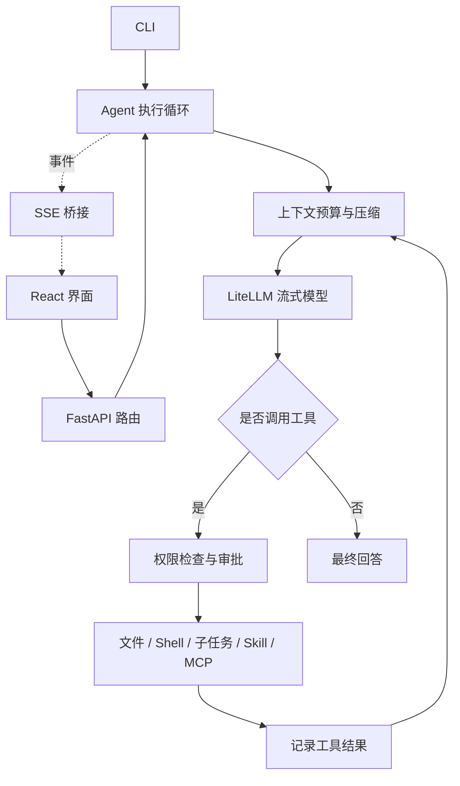

# EasyCode

一个轻量的本地 Coding Agent，使用 Python 实现模型与工具之间的执行循环，通过 CLI 或 React Web 界面完成代码阅读、检索、修改和验证。

**核心流程：用户提出任务 → 模型决定下一步 → 执行工具 → 将结果交回模型 → 输出答案。**

## 能力

- **代码工具**：读取文件、Glob / 正则检索、精确替换、写入文件和执行 Shell；界面把工具调用折叠为可展开的轨迹，并单独展示修改 diff。
- **流式交互**：LiteLLM 对接模型，FastAPI 通过 SSE 推送文本、工具结果和审批请求。
- **上下文管理**：计入系统提示词和工具 Schema 的预算，裁剪旧工具输出，用滚动摘要保留任务状态。
- **任务委派**：命名 Agent 与并行子任务使用独立对话上下文，共享工作区和权限边界；子 Agent 的工具能力不超过父 Agent，且不再递归委派。
- **项目与会话**：多项目、附加工作目录、会话持久化与置顶、模型切换和停止任务；多个会话的回合可以同时进行。
- **扩展**：`AGENTS.md` 项目规则、按需加载 Skill、提示词模板和 MCP 工具。
- **执行权限**：操作审批、精确路径授权、macOS 工作区沙箱；模型凭据单独保存在用户目录。
- **任务清单**：模型通过 `update_todos` 维护多步任务的进度。清单由执行中的 Agent 持有，工具成功即提交并随会话持久化，界面在右侧面板和消息流中同步展示。

### Web 界面

侧栏自上而下是目录、置顶、项目与最近三区；主面板顶部是会话标签栏，底部悬浮输入框（空状态时居中为一张起始卡片）；右侧是可折叠的任务面板。项目行的按钮是「更多操作」（省略号）与「新建会话」（方框铅笔），分区标题加粗以区分层级。

- **目录区**始终是同一种卡片：主目录和次目录各一张。草稿和还没开始过回合的会话都能点主目录卡片切换工作目录（菜单里的「选择其他目录…」打开访达），切换由服务端确认，成功后会话的次目录换成目标项目已配置的那组，失败保留原目录；已经开始回合的卡片只显示详情，可复制路径或在此目录新建会话——它的记录、预览和工作区改动都只描述这一个目录。点「新会话」会立刻创建真实会话并继承当前会话的项目，项目行里的新建按钮改用该行的项目。卡片和新建按钮显示项目配置的名字，没有配置名时用目录名，完整路径留在提示与详情里。
- 输入 `@` 引用工作区文件（插入的是文件的绝对路径，含空格路径会加引号），输入 `/` 打开命令菜单；输入框右侧可切换模型、语音输入。菜单汇总所有已登记项目与个人目录里的命令和 Skill，同名的条目按来源分别列出（如两个项目各有一个 `/deploy`），选中后请求带上该条目的标识，服务端按它重新发现并校验来源，仍在当前会话的目录与权限范围内展开；直接输入 `/名称` 而不从菜单选择时，沿用当前项目与个人命令的解析规则。菜单在加载、无匹配、列表为空和加载失败时都保持可见，失败时给出原因与重试。
- 菜单有明确状态：空 `@` 只提示「输入文件名搜索」，不列出整个工作区（明确搜索隐藏文件时仍能找到）；查询中显示「正在查找文件」，失败给出原因和重试，只有查完且无匹配才显示空结果；菜单打开时回车只用于选择结果，`Escape` 关闭后才恢复发送。
- 中文输入法组词期间输入框由输入法接管：候选词、回车和光标都属于它，`@`、`/` 菜单不跟着拼音翻动，上屏后只同步一次，不会出现重复的拼音字母。
- 多行输入随内容增高，到上限后内部滚动；浮层输入框会把自己的高度同步给消息区，最后一条回复不会被遮住。
- 消息流只在视口停在底部时跟随新内容；向上阅读时暂停跟随并出现「有新内容 · 回到最新」，切回会话时恢复各自的阅读位置。
- 右侧面板按「任务 / 上下文 / 变更 / 文件」分区：卡片按工具真实返回的结果生成（读取给内容、搜索给命中文件、`dry_run` 的补丁标注「未应用」），只有真实文件才是可点击的预览入口。上下文与变更来自会话自己保存的文件工具记录，因此刷新、切换会话乃至上下文压缩之后仍然可看；文件区列出整场会话读取、搜索、修改涉及的**去重文件**（同名文件按规范化后的绝对路径区分），并接上当前工作区未提交改动里的文件；搜索命中默认只列一部分，可以展开全部。
- 变更区默认收成一行统计：当前工作区相对各仓库 `HEAD` 的未提交改动共增删多少行、涉及几个文件。点开后先按文件列出各自的增删统计，每个文件再点一下才显示它自己的 diff。展开后仍分开列两组来源：「会话操作记录」是这场会话真正改过的文件与补丁，「当前工作区未提交改动」读取项目及次目录所在 Git 仓库的实时状态，包含已暂存、未暂存和未跟踪的文件（以及会话开始前就存在的改动），因此两者不会互相冒充——目录不在 Git 仓库时这行统计回退到会话自己的 diff，已有的操作记录不会因此消失。二进制、已删除或过大的文件保留统计行并说明原因，不给出用不了的预览。
- 面板开关属于整个窗口：在哪个会话里开合，切到别的会话也保持；选中分区和预览目标仍按会话保存。任务执行中出现本回合的新产物时自动展开，手动关闭后本轮不再展开、下一轮恢复，切换会话本身不会展开它。聊天区低于 560px 宽时面板改为覆盖式抽屉（不自行展开，`Escape` 或关闭按钮收起并把焦点还给开关），更宽的窗口继续并排显示。
- 任务面板始终展示唯一的任务清单；当前回合没有更新清单时标注「上次清单」，避免把旧进度读成正在进行的工作。
- 切换标签或侧栏会话只切换视图：后台会话的回合继续运行，标签与会话行显示运行中与待审批标记；打开的标签与当前标签、以及每个会话未发送的草稿都保存在本机浏览器里，刷新后回到原来的会话并带回草稿。关闭一个还没开始过回合的空白标签会连同该会话一起删除（由服务端确认后执行），已有回合的标签只关闭视图；首次进入应用停在起始页，不会自动建会话。
- 模型切换是全局的：菜单按供应商分组、按别名列出模型，说明它影响所有已有会话和新会话，有回合在运行时不能切换；输入框旁显示的是当前会话实际使用的模型，右上角状态只在空闲时显示「就绪」。
- 添加与编辑共用一个表单：别名只在本机标识模型，模型 ID 原样发给服务商，供应商只决定菜单分组。编辑时留空 API Key 表示沿用已有密钥，「清除连接凭据」会连 Base URL 一起删除；删除模型需要确认，旧会话保留历史，但下次发送前要换成可用模型。
- 菜单、浮层与弹窗都按视口定位，不会被聊天卡片或输入框的边缘裁掉；窗口变矮或开启右侧面板时，列表在自己的区域内滚动。
- 项目内的「在此项目下新建会话」不受其他项目回合影响；归档项目需要该项目没有运行中的会话，删除则先取消再回收。

界面部分有参考 [www.beautifului.dev](https://www.beautifului.dev)。

## 快速开始

需要 Python 3.11+、uv，以及用于构建界面的 Node.js / npm。工作区 Shell 沙箱依赖 macOS；其他平台可使用文件工具，Shell 需要明确选择全访问模式。

```bash
uv sync --frozen
npm --prefix frontend ci
npm --prefix frontend run build
uv run easycode web
```

打开 <http://127.0.0.1:8000>，添加模型、填写 API Key 和接口地址，选择项目目录后开始会话。示例任务：

> 阅读这个项目的入口，找到配置加载流程，为它补充一个配置校验，并运行相关测试。

Web 默认只监听本机，也可以指定端口：

```bash
uv run easycode web --port 9000
```

在 Web 配好模型后，可以使用同一个配置运行 CLI：

```bash
uv run easycode main --root /path/to/project
uv run easycode main --help
```

项目配置位于 `easycode.config.json`，凭据位于 `~/.easycode/credentials.json`，会话位于 `~/.easycode/sessions/`。这些本地数据均不进入版本控制。可选的 `max_tool_iterations` 限制一次用户消息内的模型调用轮数，缺省或 `null` 表示不限（由模型结束回合）；显式设置必须是正整数，其余取值在加载时报错。

## 架构



CLI 与 Web 共用同一个 Agent。模型适配、上下文压缩和文件工具不依赖界面；Web 路由只负责请求校验、会话管理与事件传输。

建议按以下顺序阅读代码：

| 入口 | 职责 |
| --- | --- |
| [`agent/loop.py`](src/easycode/agent/loop.py) | `respond → _turn → _execute_tool`：任务从输入到完成的完整路径 |
| [`agent/compaction.py`](src/easycode/agent/compaction.py) | 压缩前检查预算、裁剪输出、生成滚动摘要 |
| [`tools/`](src/easycode/tools/) | Pydantic 参数校验、工具注册、文件与 Shell 执行 |
| [`agent/builtin_tools.py`](src/easycode/agent/builtin_tools.py) | 子任务委派、并行执行和 Skill 加载 |
| [`agentfactory.py`](src/easycode/agentfactory.py) | 根据配置装配 Agent，统一模型与凭据接入 |
| [`web/main.py`](src/easycode/web/main.py) | 应用装配；路由分为 chat、models、sessions、workspaces、files，[`web/artifacts.py`](src/easycode/web/artifacts.py) 保存面板读取的文件工具记录，[`web/git.py`](src/easycode/web/git.py) 读取工作区实时状态 |
| [`web/bridge.py`](src/easycode/web/bridge.py) | Agent 事件转为 SSE，处理审批等待和停止信号 |
| [`frontend/src/useChatStream.ts`](frontend/src/useChatStream.ts) | 按会话的流注册表：每个会话的回合独立进行；`chatStream.ts` 负责消息状态转换 |
| [`frontend/src/components/layout/`](frontend/src/components/layout/) | 标签栏、右侧面板容器、输入框 |
| [`frontend/src/components/primitives/`](frontend/src/components/primitives/) | 加载态、工具轨迹、代码块、diff、变更列表、审批卡、任务清单、空状态 |
| [`frontend/src/lib/`](frontend/src/lib/) | 侧栏分组、任务轨迹、面板数据、`@` 解析等纯函数 |

### 设计取舍

- **围绕正向执行组织状态**：保留已完成的工具操作和历史记录，不提供撤销、重做或自动文件回滚；需要恢复代码时使用 Git。
- **停止后仍可继续对话**：保留已生成文本，为未完成的工具调用记录中断结果，使下一轮的工具消息保持配对。已启动的同步工具或 Shell 可能继续完成，停止不撤销其副作用。
- **删除先取消再回收**：删除会话或项目会先取消运行中的回合、等待其收尾，再删除会话文件并关闭该会话拥有的 MCP 进程；删除后不会重新启动后续工具，但已启动的工具副作用不撤销。会话文件删除失败会明确报错并可重试，不会返回成功后在刷新时复活。
- **配置与归档变更有明确收尾**：请求被取消时，已经开始的配置或会话写入仍会完成后释放保护；项目归档只保存该项目的会话，项目内有运行中会话时返回忙碌提示。
- **权限修改以服务器确认为准**：Web 中切换权限模式时，界面保持当前已确认值，保存期间该选择器禁用且发送暂时阻止；失败时保留原权限并提示错误，不做乐观回滚。
- **上下文有明确边界**：摘要与近期消息一起交给模型；压缩后仍超出预算时报告错误，避免继续发送无法容纳的请求。
- **工具失败可反馈给模型**：参数错误和执行失败作为工具结果返回，模型可据此调整下一步；模型连接失败向界面报告。
- **工具循环由模型结束**：每次工具执行后将结果交回模型，由模型决定继续调用工具或给出最终答复；默认不设每回合的轮数上限。需要控制运行量时在项目配置里显式设置 `max_tool_iterations`（正整数，按模型调用轮数计数，不是工具个数）；触顶时结束本回合并发出 `tool_iteration_limit` 错误，已执行的操作、工具结果和任务清单都保留，界面提供只填草稿、不自动发送的「继续未完成任务」入口。用户仍可停止正在运行的回合。服务端产生的这类错误随会话记录，刷新后回到它结束的那个回合。
- **审批结果与执行结果分开表述**：审批卡片只陈述决定（已批准执行请求 / 已拒绝请求），调用是否成功由工具结果回答；模型可见的工具结果会带上本次调用已获批准的事实，因为 `in_allowed` 只说明目标是否在工作区内。硬保护路径（`.git`、`.easycode`、项目配置、凭据）在展示审批前就被拒绝，不会让人批准一次注定失败的文件写入，完全访问模式下文件工具同样不放行。
- **实现保持直接**：当前会话格式直接读写，不保留旧接口转发、旧数据目录迁移或隐藏的文件恢复流程。
- **每个会话一条独立的流**：切换标签或会话不中断后台回合，一个会话同一时刻只有一个回合（服务端以会话锁拒绝重复请求）；界面按会话保存各自的条目、草稿、面板分区、预览目标与阅读位置，标签与会话行显示运行中与待审批状态，而面板开关和已打开的标签属于整个窗口。
- **工作目录只在会话开始前可改**：空白会话可以换项目目录（由服务端确认，并继承目标项目的次目录），第一轮开始后目录固定——记录、预览和工作区改动都只描述这一个目录，换掉会让它们对不上。
- **文件用唯一目标标识**：相对路径只用于展示，引用、预览和工具结果都带绝对目标（`/api/files` 的 `absolute_path`、`read_file` 的同名字段），搜索命中用记录下来的 root 还原；同一个相对文件名出现在多个根下也能指向正确的文件。列出符号链接时会先解析实际目标，预览会拒绝的目标不出现在列表里。
- **面板与预览只读**：右侧面板的文件列表与内容预览复用会话自己的路径上下文，越界与硬保护路径（凭据、`.git`、`.easycode`、项目配置）一律拒绝；列出文件沿用工具的忽略规则与大小上限，预览按固定大小分块读取，超出字节预算的部分只计数不保留。
- **`@` 文件查询用 POST**：请求需要区分「未提供次目录」与「显式不使用次目录」，查询字符串表达不了这个三态。`/api/commands` 因此不再需要请求体：菜单汇总所有登记项目与个人目录，与当前会话无关，改回 GET。
- **命令选择带标识回传**：菜单能列出同名但来自不同项目的命令，所以选中项发送的是它的标识（`<来源>:<项目目录>:<名称>`），服务端重新发现列表后再校验并展开——请求无法用这个字段指名任意路径，未登记项目的命令直接拒绝。

## 扩展

在项目 `.easycode/` 或用户目录 `~/.easycode/` 中放置扩展文件：

| 类型 | 路径 | 示例 |
| --- | --- | --- |
| Agent | `agents/<name>.md` | [代码规划 Agent](examples/agents/plan.md) |
| Skill | `skills/<name>/SKILL.md` | [Skill 编写说明](examples/skills/skill-creator/SKILL.md) |
| 命令 | `commands/<name>.md` | [提示词模板](examples/commands/btw.md) |

项目根目录的 `AGENTS.md` 提供代码规范。外部工具通过配置中的 `mcp_servers` 接入，支持 stdio 和 HTTP 传输；MCP 子进程随所属会话删除、Web 服务关闭或 CLI 退出回收，子 Agent 借用父级进程，上下文不同的子 Agent 使用并回收自己的进程。

Web 的 `/` 菜单只列出可执行的模板与 Skill（含所有已登记项目与个人目录）。CLI 另提供 `/help`、`/model`、`/run`、`/skills`、`/agents` 和 `/exit`。

## 验证

测试使用模拟模型响应和临时目录，无需真实模型凭据。覆盖工具调用循环、上下文压缩、权限边界、MCP、会话持久化、停止后继续对话和前端流式状态。

```bash
uv run --frozen ruff check src tests
uv run --frozen pytest
npm --prefix frontend run lint
npm --prefix frontend run build
npm --prefix frontend run test:run
```
