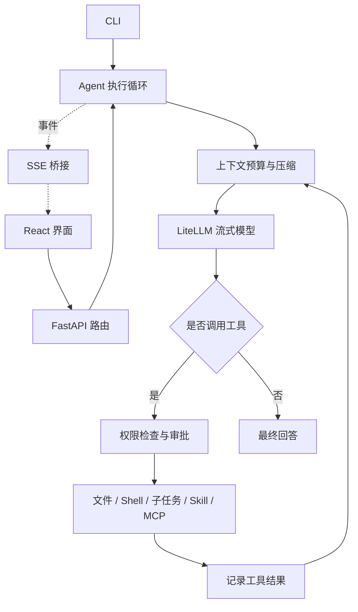

# EasyCode

一个轻量的本地 Coding Agent，使用 Python 实现模型与工具之间的执行循环，通过 CLI 或 React Web 界面完成代码阅读、检索、修改和验证。

**核心流程：用户提出任务 → 模型决定下一步 → 执行工具 → 将结果交回模型 → 输出答案。**

## 能力

- **代码工具**：读取文件、Glob / 正则检索、精确替换、写入文件和执行 Shell；界面展示工具进度与修改 diff。
- **流式交互**：LiteLLM 对接模型，FastAPI 通过 SSE 推送文本、工具结果和审批请求。
- **上下文管理**：计入系统提示词和工具 Schema 的预算，裁剪旧工具输出，用滚动摘要保留任务状态。
- **任务委派**：命名 Agent 与并行子任务使用独立对话上下文，共享工作区和权限边界；子 Agent 的工具能力不超过父 Agent，且不再递归委派。
- **项目与会话**：多项目、附加工作目录、会话持久化、模型切换和停止任务。
- **扩展**：`AGENTS.md` 项目规则、按需加载 Skill、提示词模板和 MCP 工具。
- **执行权限**：操作审批、精确路径授权、macOS 工作区沙箱；模型凭据单独保存在用户目录。

## 快速开始

需要 Python 3.11+、uv，以及用于构建界面的 Node.js / npm。工作区 Shell 沙箱依赖 macOS；其他平台可使用文件工具，Shell 需要明确选择全访问模式。

```bash
uv sync --frozen
npm --prefix frontend ci
npm --prefix frontend run build
uv run easycode web
```

打开 <http://127.0.0.1:8000>，添加模型、填写 API Key 和接口地址，选择项目目录后开始会话。示例任务：

> 阅读这个项目的入口，找到配置加载流程，为它补充一个配置校验，并运行相关测试。

Web 默认只监听本机，也可以指定端口：

```bash
uv run easycode web --port 9000
```

在 Web 配好模型后，可以使用同一个配置运行 CLI：

```bash
uv run easycode main --root /path/to/project
uv run easycode main --help
```

项目配置位于 `easycode.config.json`，凭据位于 `~/.easycode/credentials.json`，会话位于 `~/.easycode/sessions/`。这些本地数据均不进入版本控制。

## 架构



CLI 与 Web 共用同一个 Agent。模型适配、上下文压缩和文件工具不依赖界面；Web 路由只负责请求校验、会话管理与事件传输。

建议按以下顺序阅读代码：

| 入口 | 职责 |
| --- | --- |
| [`agent/loop.py`](src/easycode/agent/loop.py) | `respond → _turn → _execute_tool`：任务从输入到完成的完整路径 |
| [`agent/compaction.py`](src/easycode/agent/compaction.py) | 压缩前检查预算、裁剪输出、生成滚动摘要 |
| [`tools/`](src/easycode/tools/) | Pydantic 参数校验、工具注册、文件与 Shell 执行 |
| [`agent/builtin_tools.py`](src/easycode/agent/builtin_tools.py) | 子任务委派、并行执行和 Skill 加载 |
| [`agentfactory.py`](src/easycode/agentfactory.py) | 根据配置装配 Agent，统一模型与凭据接入 |
| [`web/main.py`](src/easycode/web/main.py) | 应用装配；路由分为 chat、models、sessions、workspaces |
| [`web/bridge.py`](src/easycode/web/bridge.py) | Agent 事件转为 SSE，处理审批等待和停止信号 |
| [`frontend/src/useChatStream.ts`](frontend/src/useChatStream.ts) | 流式请求生命周期；`chatStream.ts` 负责消息状态转换 |

### 设计取舍

- **围绕正向执行组织状态**：保留已完成的工具操作和历史记录，不提供撤销、重做或自动文件回滚；需要恢复代码时使用 Git。
- **停止后仍可继续对话**：保留已生成文本，为未完成的工具调用记录中断结果，使下一轮的工具消息保持配对。已启动的同步工具或 Shell 可能继续完成，停止不撤销其副作用。
- **删除先取消再回收**：删除会话或项目会先取消运行中的回合、等待其收尾，再删除会话文件并关闭该会话拥有的 MCP 进程；删除后不会重新启动后续工具，但已启动的工具副作用不撤销。会话文件删除失败会明确报错并可重试，不会返回成功后在刷新时复活。
- **配置与归档变更有明确收尾**：请求被取消时，已经开始的配置或会话写入仍会完成后释放保护；项目归档只保存该项目的会话，项目内有运行中会话时返回忙碌提示。
- **权限修改以服务器确认为准**：Web 中切换权限模式时，界面保持当前已确认值，保存期间该选择器禁用且发送暂时阻止；失败时保留原权限并提示错误，不做乐观回滚。
- **上下文有明确边界**：摘要与近期消息一起交给模型；压缩后仍超出预算时报告错误，避免继续发送无法容纳的请求。
- **工具失败可反馈给模型**：参数错误和执行失败作为工具结果返回，模型可据此调整下一步；模型连接失败向界面报告。
- **实现保持直接**：当前会话格式直接读写，不保留旧接口转发、旧数据目录迁移或隐藏的文件恢复流程。

## 扩展

在项目 `.easycode/` 或用户目录 `~/.easycode/` 中放置扩展文件：

| 类型 | 路径 | 示例 |
| --- | --- | --- |
| Agent | `agents/<name>.md` | [代码规划 Agent](examples/agents/plan.md) |
| Skill | `skills/<name>/SKILL.md` | [Skill 编写说明](examples/skills/skill-creator/SKILL.md) |
| 命令 | `commands/<name>.md` | [提示词模板](examples/commands/btw.md) |

项目根目录的 `AGENTS.md` 提供代码规范。外部工具通过配置中的 `mcp_servers` 接入，支持 stdio 和 HTTP 传输；MCP 子进程随所属会话删除、Web 服务关闭或 CLI 退出回收，子 Agent 借用父级进程，上下文不同的子 Agent 使用并回收自己的进程。

Web 的 `/` 菜单只列出可执行的模板与 Skill。CLI 另提供 `/help`、`/model`、`/run`、`/skills`、`/agents` 和 `/exit`。

## 验证

测试使用模拟模型响应和临时目录，无需真实模型凭据。覆盖工具调用循环、上下文压缩、权限边界、MCP、会话持久化、停止后继续对话和前端流式状态。

```bash
uv run --frozen ruff check src tests
uv run --frozen pytest
npm --prefix frontend run lint
npm --prefix frontend run build
npm --prefix frontend run test:run
```
