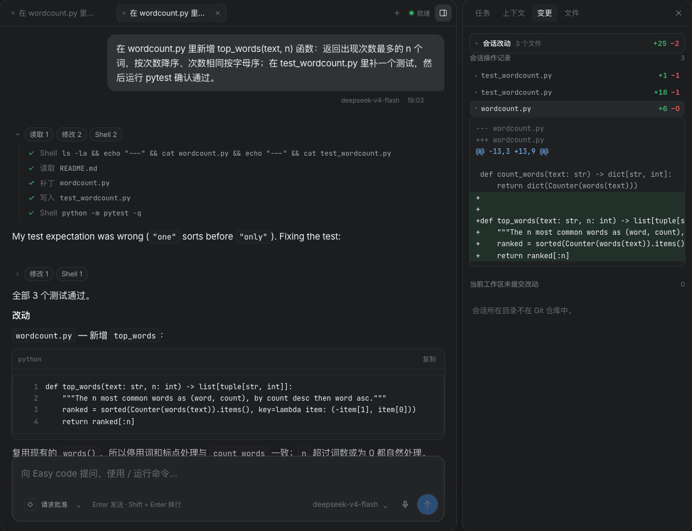
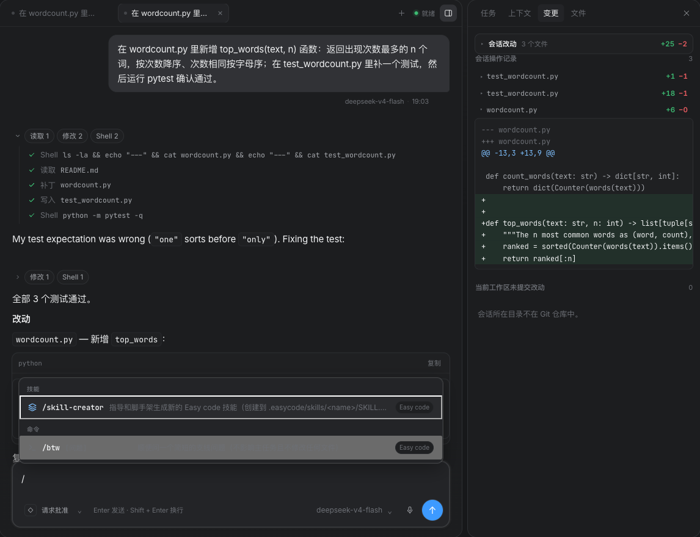
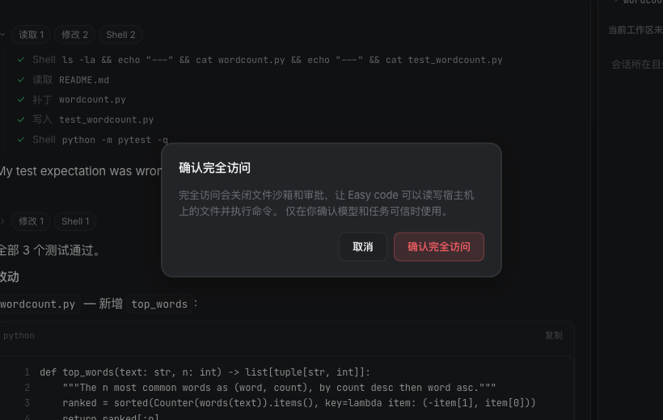

<h1 align="center">EasyCode</h1>

<p align="center">用 Python 实现的本地 Coding Agent：模型与工具之间的执行循环，配终端界面与 React Web 界面；在走出项目目录之前，它会先征求你的同意。</p>

<p align="center">
  <a href="./README.md">English</a> | <a href="./README.zh-CN.md">简体中文</a>
</p>

<p align="center">
  
  
  
</p>

EasyCode 把模型接到一组文件与 Shell 工具上，让它一步步做完一件事：模型要求调用工具 → 工具执行 →
结果交回模型 → 模型不再要求调用工具时本回合结束。CLI 与 Web 共用同一个循环。

## 亮点

| 亮点 | 实际效果 |
| --- | --- |
| 全部留在本机 | Agent、配置、凭据与会话记录都在你的项目和 `~/.easycode` 里；除了你自己配置的模型调用，没有数据外发。 |
| 能读、能搜、能改、能跑 | 文件工具加工作区内的 Shell；每次工具调用都在界面里留下轨迹，文件改动以 diff 呈现。 |
| 权限有真实边界 | 三种模式：工作区内直接执行，越界先征求批准（或由独立的 reviewer 判定），macOS 上 Shell 还套一层 Seatbelt 沙箱。 |
| 会话并行推进 | 多个会话可以同时进行各自的回合，各自保留标签、草稿、面板状态与阅读位置。 |
| 靠加文件扩展 | `AGENTS.md` 规则、Skill、提示词模板和 MCP 服务都是放进项目或用户目录的文件。 |

## 架构

两个界面驱动同一个 Agent 循环：CLI 直接调用，Web 经过 FastAPI，并由 SSE 把文本、工具结果和审批请求
推给浏览器。模型访问走 LiteLLM，因此任何兼容的接口都能配置进来。

```text
            ┌────────────────────┐            ┌────────────────────┐
            │    CLI (Typer)     │            │    React web UI    │
            │   prompt-toolkit   │            │ Vite + TypeScript  │
            └──────────┬─────────┘            └──────────┬─────────┘
                       │                                 │ HTTP + SSE
                       └────────────────┬────────────────┘
                                        ▼
                      ┌────────────────────────────────────┐
                      │             Agent loop             │
                      │    context budget + compaction     │
                      └───────┬────────────────────┬───────┘
                   model call │                    │  tool call
                              ▼                    ▼
                      ┌─────────────────┐  ┌─────────────────┐
                      │  Model adapter  │  │   Permission    │
                      │    (LiteLLM)    │  │  macOS sandbox  │
                      └─────────────────┘  └───────┬─────────┘
                                                   ▼
                                      ┌───────────────────────────┐
                                      │  Files · Shell · skills   │
                                      │ sub-agents · MCP servers  │
                                      └───────────────────────────┘
```

## 界面

下面是一次真实会话，项目是临时建的：让模型给 `wordcount.py` 加上 `top_words`、补测试并运行 `pytest`。
它读文件、改模块、写测试、跑测试；其中一个测试断言第一次写错，它自己修正后重跑通过。



右侧面板跟踪本场会话的任务清单、上下文、改动过的文件，以及任意已触碰文件的预览。`/` 列出工作区里
登记的命令与 Skill，`@` 按路径引用文件。



完全访问会关闭沙箱与审批，因此进入前必须先确认。



## 快速安装

```bash
uv sync --frozen
npm --prefix frontend ci
npm --prefix frontend run build
```

需要 Python 3.11+、uv，以及带 npm 的 Node.js。

## 快速开始

```bash
uv run easycode web
```

打开 <http://127.0.0.1:8000>，添加模型（模型 ID、API Key 与接口地址），选择项目目录后开始会话。
第一个任务可以这样写：

> 阅读这个项目的入口，找到配置加载流程，为它补充一个配置校验，并运行相关测试。

服务默认只监听本机，`uv run easycode web --port 9000` 可以换端口。CLI 复用同一份配置：

```bash
uv run easycode main --root /path/to/project
uv run easycode main --help
```

## 功能

- 工具：读取、检索（glob 与正则）、精确替换、写入，以及工作区内的 Shell。
- 上下文：计入系统提示词与工具 Schema 的预算，裁剪旧工具输出，并保留滚动摘要。
- 任务清单：多步任务由模型维护，面板与消息流同步展示。
- 任务委派：命名子 Agent 与并行子任务各有独立上下文，工具能力不超过父 Agent。
- 项目与会话：多项目、附加工作目录、置顶、切换模型、停止回合。
- 审批：工作区内直接执行；越界操作先征求批准，自动审查模式由第二个模型判定。
- Shell 沙箱：macOS 上的 Shell 运行在只放行工作区的 Seatbelt 策略里。

## 配置

项目里的 `easycode.config.json` 保存模型列表、启用的工具、权限模式、工作区项目、MCP 服务，以及
`max_tool_iterations`（可选的本回合模型调用上限，不设则由模型结束回合）。凭据在
`~/.easycode/credentials.json`，会话在 `~/.easycode/sessions/`。这些本地数据都不进入版本控制。

## 扩展

| 类型 | 路径 | 示例 |
| --- | --- | --- |
| Agent | `agents/<name>.md` | [代码规划 Agent](examples/agents/plan.md) |
| Skill | `skills/<name>/SKILL.md` | [Skill 编写说明](examples/skills/skill-creator/SKILL.md) |
| 命令 | `commands/<name>.md` | [提示词模板](examples/commands/btw.md) |

它们既可以放在项目的 `.easycode/`，也可以放在 `~/.easycode/`。MCP 服务在 `easycode.config.json`
里配置，支持 stdio 与 HTTP。

## 代码结构

| 路径 | 内容 |
| --- | --- |
| `src/easycode/agent/` | 执行循环、上下文预算与压缩、提示词、内置工具 |
| `src/easycode/tools/` | 文件与 Shell 工具 |
| `src/easycode/policy.py`、`approval.py`、`sandbox/` | 权限模式、审批、macOS 沙箱 |
| `src/easycode/web/`、`frontend/` | FastAPI 应用与 React 界面 |
| `tests/`、`frontend/src/__tests__/` | 后端与前端测试 |
| `examples/` | 示例 Agent、Skill、命令，以及一个零依赖的演示项目 |

## 开发

```bash
uv run --frozen ruff check src tests
uv run --frozen pytest
npm --prefix frontend run lint
npm --prefix frontend run build
npm --prefix frontend run test:run
```

测试使用模拟模型与临时目录，不需要真实凭据。CI 在每次 push 与 PR 上运行这两组检查；Shell 沙箱依赖
macOS，相关集成用例在 Linux 上整体跳过。

## 设计说明

- 只保留正向执行：已完成的工具调用与结果留在对话里，不提供撤销、重做或自动回滚，需要恢复代码时用
  Git；工具调用与结果始终配对，因此回合总能继续。
- 停止不是回滚：已生成的文本保留，未完成的工具调用记录中断结果，已经启动的 Shell 可能仍会跑完。
- 删除先取消：删除会话或项目会先取消运行中的回合、等它收尾再删文件，删除失败会明确报错而不是假装
  成功。
- 边界落在执行路径上：文件工具、Shell 沙箱、子 Agent、MCP 进程和只读预览接口都会各自复核会话自己
  的路径上下文。
